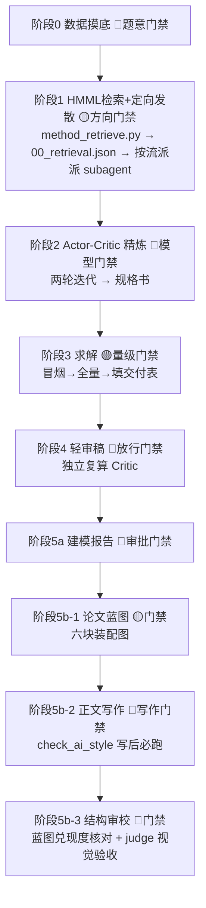

# Math-Modeling-Agent（数学建模竞赛全自动流水线）

[](https://opensource.org/licenses/MIT)
[](https://www.mcm.edu.cn)


面向全国大学生数学建模竞赛（CUMCM）/美赛的**多智能体建模流水线 skill**。核心取向与主流"全自动"agent 相反：**在信息熵最高的决策点引入人工审校（HITL）**，其余环节全自动；验证严谨只在真正需要的那一步上。

> 设计取舍：砍掉重型验证（全套数值溯源 log / 公理化 KKT / 交叉审计）与并行编纂，
> 保留 **HMML 方法检索定向发散 → Actor-Critic 精炼 → 求解 → 轻审稿 → 蓝图式串行写作** 主干。

---

## 📊 实测状态

| 轮次 | 题目 | 题型 | 结果 |
|---|---|---|---|
| 第一轮全量（2026-08-29） | 2021C 生产企业原材料订购与运输 | 数据驱动评价+规划 | 九阶段端到端全通，论文 14 页，六 sheet 回填 |
| 第二轮全量（2026-08-30） | 2022A 波浪能最大输出功率设计 | 机理 ODE+连续优化 | 九阶段全通，论文 16 页（judge 视觉验收 16/16），对比三篇国奖论文水位 **93/100** |
| 历史对照 | 2025A 烟幕干扰弹 | 几何优化 | 对比国奖 A196 水位 88.65/100 |

第二轮实测了 skill 的两条未测主干（机理流派、去 AI 味门禁），并且**对比测评真实纠正了一个错误结论**（幂律阻尼最优 α* 被三篇国奖论文的证据链推翻后重寻优修正）——完整的根因分析与门禁加固记录见 `RCA_2022A_Q22_and_skill_improvements.md` 与 `CHANGELOG.md`。

---

## 🌟 九阶段流水线 + 9 个 HITL 门禁



**HITL 机制**（`roles/hitl_reviewer.md`）：门禁阶段生成 `.modeling/hitl/<phase>_gate.md` 并标记 `waiting_human`，主 agent 在对话流注入审校提醒并**等用户回复**（confirm/edit/regenerate/skip/abort）；用户缺席时按 skill 规则降级 `confirm_degraded` 并落盘 feedback JSON 审计——**不静默、不伪造确认**。2022A 轮实测：9 门禁全真实运行（1 live + 8 降级审计）。

---

## 🛡️ 核心纪律（2026-08-30 加固后全量）

**门禁加固四条**（源自 2022A Q2(2) 结论被对比测评推翻的 RCA，见 `RCA_2022A_Q22_and_skill_improvements.md`）：

1. **题意基线逐字回查**（阶段0）：每条题意基线附题面原文逐字引用；启动提示词/摘要与原文冲突时以原文为准；
2. **判决性论证分级**（阶段2）：全局性结论的论证须标级——精确代数证明 > 全空间收敛扫描 > 近似论证（谐波平衡/描述函数/摄动）；近似论证声明误差须小于被判定差异的 1/3，否则只作佐证；
3. **优化题全局性门禁**（阶段3）：快/慢评估 ≥3 点定标、最优点及邻域收敛档复评、边界最优报 unconstrained 最优+松弛走势；
4. **Critic 任务书由题型检查单生成**（阶段4）：不由被审者起草；优化题固定含独立重寻优/边界检查/定标抽查，并固定任务"主动寻找与主结论相反的证据"。

**既有纪律**：反过拟合（结构选择须显著性/交叉验证证据）、竞赛合规红线（匿名/无目录/摘要独立成页/主节"一、二、三、"/AI 使用声明如实）、失败诚实（不收敛/检验不显著/文件读不了，如实写入禁止静默跳过）、去 AI 味（`check_ai_style.py` 写后必跑，规则库 `references/no_ai_style.md`）、A196 对比回灌（每问策略规律段+参考文献节+精确归约定理）。

---

## 📂 目录结构

```text
math-modeling-agent/
├── SKILL.md                        # [技能总控入口] 九阶段状态机 + HITL + 健康检测
├── RCA_2022A_Q22_and_skill_improvements.md   # 结论错误根因分析 + 门禁加固提案（已落地）
├── SESSION_EXPORT_20260829_2021C.md / HITL_full_test_prompt_*.md   # 测试轮次记录与标准测试提示词
├── roles/                          # 流派与职能提示词
│   ├── draft_protocol.md           # 方向卡片协议（建模哲学/模型族/关键难点）
│   ├── offline_mechanistic|optimization|survival_stat|robust_decision|prediction_ml.md
│   ├── online_prior_scout.md / online_benchmark_miner.md
│   ├── modeling_synthesizer.md / model_critic.md / production_engineer.md
│   ├── hitl_reviewer.md            # 人工审校门禁（主 agent 行为约束，强提示词）
│   ├── modeling_reporter.md / paper_planner.md / chapter_writer.md / paper_structural_reviewer.md
├── templates/                      # LaTeX 主模板 + 章节占位 + TikZ 图骨架 + AI 披露模板
├── references/                     # method_library(HMML 96 法) / paper_structure / no_ai_style /
│                                   # paper_figures / figure_catalog / cumcm_reviewer_pitfalls / hitl_design
├── scripts/
│   ├── run_pipeline.py             # 九阶段编排器：目录骨架 + 门禁注入 + phase_status.json
│   ├── method_retrieve.py          # HMML 关键词检索 → school 归属 → 落盘供 subagent 消费
│   ├── check_ai_style.py           # 去 AI 味检测（痕迹词 + 句长 CV + 术语一致）
│   ├── fig_helpers.py              # 配图统一工具库（PALETTE + SciencePlots + 200dpi 双格式）
│   ├── health_check.py             # 首次运行健康与适配检测（13 项）
│   └── greedy_segmentation / lmm_variance_decomp / robust_qc_3zone / cluster_bootstrap
├── benchmarks/                     # 评测驱动迭代
│   ├── problems/2021C|2022A|2025A.../   # 真题 + 附件 + result 模板 + .modeling 运行产物（gitignore）
│   ├── scoring_rubric.md / auto_checks.py
├── tests/                          # pytest 回归套件
└── .github/workflows/ci.yml        # GitHub Actions：pytest + tectonic 冒烟
```

> `.modeling/`（各题运行产物：论文/规格书/交付表/审计）按仓库策略 gitignore，留在本地。

---

## 🧭 探索流派与归属映射（HMML school → roles/）

| school | 角色文件 | 覆盖方向 |
| :--- | :--- | :--- |
| `opt` | offline_optimization.md | LP、MILP、DP、图论、GA/SA/PSO、KKT、网络流 |
| `mech` | offline_mechanistic.md | ODE/PDE、LMM、传染病、守恒/传播方程 |
| `surv` | offline_survival_stat.md | Cox/AFT、GARCH、排队论、CVaR、MDP |
| `robust` | offline_robust_decision.md | 熵权法、TOPSIS、AHP、秩相关、ANOVA |
| `pred` | offline_prediction_ml.md | ARIMA、灰色GM、SVM、K-means、PCA、Boosting |
| 联网 | online_prior_scout / online_benchmark_miner | 领域先验 / 顶刊基准与范式 |

阶段 1 由 `method_retrieve.py` 的 `school` 字段决定派哪个 subagent；命中多个方向则只派相关的 2-3 个，其余跳过。

---

## 🚀 使用方法

**跨平台**：Google Antigravity / Gemini CLI 用 `invoke_subagent` 并发；Claude Code / Cursor 按 `.modeling/` 黑板协议顺序加载 `roles/`；Hermes 用 `delegate_task`，检索结果经落盘 `00_retrieval.json` 注入 subagent 任务书。环境不支持并发子代理时，阶段 1 流派**串行退化**，禁止跳过。

```bash
# 1) 首次运行先做健康与适配检测（之后有 .health_checked 自动跳过）
python scripts/health_check.py

# 2) 把任务提示词发给 agent（benchmarks/ 里有标准测试提示词）；
#    编排骨架亦可单独驱动：
python -c "from scripts.run_pipeline import MathModelingPipeline; \
           MathModelingPipeline('benchmarks/problems/2022A/problem.md', 'benchmarks/problems/2022A').run(mode='live')"

# 3) 论文写完后跑去 AI 味门禁；回归测试：
python scripts/check_ai_style.py <段落.tex|目录>
python -m pytest tests/ -q
```

环境依赖：Python ≥3.10（numpy/pandas/scipy/statsmodels/pulp/openpyxl/matplotlib+SciencePlots）、Tectonic（LaTeX）、fitz（可选，扫描 PDF 读取）。

## 📜 竞赛合规性声明

本体系遵循《全国大学生数学建模竞赛人工智能工具使用规定（2026 年试行）》：参赛队主导顶层设计，确定性算法与数值全流程验证；自动生成合规的《AI 工具使用声明》与《AI 工具使用详情.pdf》支撑材料（模板见 `templates/ai_disclosure_template.md`）。

## 📄 License

MIT
