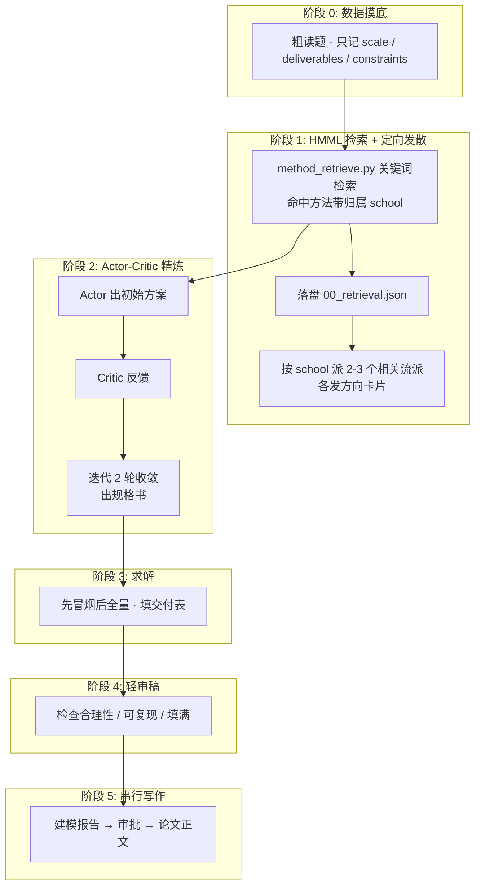

# Math-Modeling Multi-Agent Optimization Skill (数学建模多智能体快速流水线)

[](https://opensource.org/licenses/MIT)
[](https://www.mcm.edu.cn)

竞赛级/科研级（面向全国大学生数学建模竞赛 CUMCM、美赛 MCM/ICM）数学建模多智能体协同流水线。
**精简版**：默认走最短路径，多子智能体发散保留但只做方向引导，严谨只在真正需要的那一步才上。

> 设计取舍：原「3 层解耦 + Artifact DAG + 具身自验证 + 5 章节并行」为追求完整交付而偏重；
> 本版改为「**HMML 方法检索定向发散 → Actor-Critic 精炼 → 求解 → 轻审稿 → 串行写作**」，
> 砍掉过度验证（数值溯源全套 log / 公理化 KKT / 交叉审计）与并行编纂，换取更低的 token 消耗与更快的迭代。

---

## 🌟 系统核心架构（精简六阶段）



**核心原则**：默认走最短路径；多子智能体发散模式保留，但提示词只做方向引导，不做强制验证。

---

## 🔍 健康与适配检测（首次运行）

首次运行本技能时，先执行：

```bash
python scripts/health_check.py
```

它会检测：Python 版本与科学计算库、Tectonic/Node 可用性、`scripts/` 五个算法模块导入+冒烟、
HMML 方法库存在性、SKILL 引用完整性，以及**最小流程**（HMML 检索 → 落盘 → 读回 → 流派 school 合法）。
结果打印为人类可读报告，并落盘 `.modeling/health_report.json` + `.modeling/.health_checked`（已检测标记）。
之后运行（存在 `.health_checked`）直接跳过。

> Agent 层适配（并发 subagent / 文件工具 / Python 执行）由主 agent 依据所在平台自评，并写入 agent 记忆系统。

---

## 📂 技能工程目录结构

```text
math-modeling/
├── SKILL.md                            # [技能总控入口] 精简六阶段状态机 + 健康检测小节
├── README.md                           # 工程说明文档
├── .gitignore                          # 过滤规则（已忽略 .modeling 运行产物）
├── roles/                              # [专职 Subagent 方向提示词（只做方向引导）]
│   ├── draft_protocol.md               # [方向卡片协议] 三部分：建模哲学/拟用模型族/关键难点
│   ├── offline_mechanistic.md          # 机理/纵向动力学派（ODE/PDE/LMM/守恒方程）
│   ├── offline_optimization.md         # 运筹/时空规划派（LP/MILP/DP/图论/GA/SA/PSO/KKT）
│   ├── offline_survival_stat.md        # 随机/生存/风险派（Cox/AFT/GARCH/排队论/CVaR/MDP）
│   ├── offline_robust_decision.md      # 稳健/评价派（熵权法/TOPSIS/AHP/秩相关/ANOVA）
│   ├── offline_prediction_ml.md        # 预测/机器学习派（ARIMA/灰色GM/SVM/K-means/PCA/Boosting）★新增
│   ├── online_prior_scout.md           # 联网·领域先验/常数/损失代价比
│   ├── online_benchmark_miner.md       # 联网·顶刊基准/数学范式
│   ├── modeling_synthesizer.md         # Actor-Critic 建模精炼（actor 出方案 + critic 反馈）
│   ├── model_critic.md                 # 轻审稿专家（一轮快速检查合理性/可复现/填满）
│   ├── production_engineer.md          # 求解引擎工程师（规格书→可执行代码→填交付表）
│   ├── modeling_reporter.md            # 建模报告撰写者（给人看的交接依据）
│   └── chapter_writer.md               # 串行段写作（按问题顺序逐段写论文）
├── templates/                          # [编排与合规模板]
│   ├── main_template.tex               # 模块化 LaTeX 总装模板
│   ├── sections/                       # 模板内嵌章节占位
│   └── ai_disclosure_template.md       # 2026 官方合规《AI工具使用声明与详情》模板
├── references/                         # [方法库与审稿规则]
│   ├── method_library.md               # HMML 层级化建模方法库（98 方法，取自 MM-Agent）★新增
│   ├── open_source_agent_ideas.md      # 开源科研 agent 框架调研（吸收灵感）★新增
│   └── cumcm_reviewer_pitfalls.md      # 评委扣分拦截与升级梯子库
├── benchmarks/                         # [评测驱动迭代引擎]
│   ├── README.md                       # 基准评测协议（真题入库/跑流程/快照/对比回归）
│   ├── scoring_rubric.md               # 百分制双轨评分体系
│   ├── auto_checks.py                  # 确定性自动检查器
│   └── problems/                       # 2021-2025 真题 + reference_answers 共识
├── tests/                              # pytest 回归套件（算法/模板/SKILL 引用完整性）
├── .github/workflows/ci.yml            # GitHub Actions：pytest + tectonic 编译冒烟
├── ROADMAP.md                          # 迭代路线图
└── scripts/                            # [确定性底层算法 + 检索 + 健康检测]
    ├── method_retrieve.py              # HMML 方法检索（98 方法覆盖）+ 落盘 00_retrieval.json ★新增
    ├── health_check.py                 # 首次运行健康与适配检测 ★新增
    ├── greedy_segmentation.py          # 有序特征异质性贪心切分算法
    ├── lmm_variance_decomp.py          # 纵向 LMM 方差分解与 REML 评估器
    ├── robust_qc_3zone.py              # 非参数 5%/95% 质控与自适应三区双阈值器
    └── cluster_bootstrap.py            # 簇级 Bootstrap 95% 置信区间与 MAD 噪声扰动分析器
```

---

## 🧭 探索流派与归属映射（HMML school → roles/）

| HMML 归属 school | 角色文件 | 覆盖的建模方向 |
| :--- | :--- | :--- |
| `opt` | `roles/offline_optimization.md` | 运筹/时空规划：LP、MILP、DP、图论、GA/SA/PSO、KKT、网络流 |
| `mech` | `roles/offline_mechanistic.md` | 机理/纵向动力学：ODE/PDE、LMM、传染病、守恒/传播方程 |
| `surv` | `roles/offline_survival_stat.md` | 随机/生存/风险：Cox/AFT、GARCH、排队论、CVaR、MDP |
| `robust` | `roles/offline_robust_decision.md` | 稳健/评价：熵权法、TOPSIS、AHP、秩相关、ANOVA |
| `pred` | `roles/offline_prediction_ml.md` | 预测/机器学习：ARIMA、灰色GM、SVM、K-means、PCA、Boosting |
| 联网 | `roles/online_prior_scout.md` / `online_benchmark_miner.md` | 领域先验/常数 / 顶刊基准与范式 |

阶段 1 由 `method_retrieve.py` 的 `school` 字段决定派哪个 subagent；命中多个方向则只派相关的 2-3 个，其余跳过。

---

## 🚀 跨 Agent 平台使用指南

### 1. 在 Google Antigravity / Gemini CLI 中运行
将本文件夹放置于相关 skills 目录，识别到数学建模赛题时自动用 `invoke_subagent` 并发动作。
若环境不支持并发子代理，阶段 1 退化为**串行**逐个加载对应 `roles/*.md`。

### 2. 在 Claude Code / Cursor / 独立 CLI 中运行
基于工作区 `.modeling/` 的标准文件系统黑板协议，依次按阶段 0 → 5 加载 `roles/` 提示词与 `scripts/` 工具包。

### 3. 在 Hermes 中运行
主线程用 `delegate_task` 派发子代理；检索结果经落盘 `00_retrieval.json` → 读回 → 注入 subagent 任务书 context 完成传送。

---

## 📜 竞赛合规性声明

本体系严格遵循《全国大学生数学建模竞赛人工智能工具使用规定（2026年试行）》，采用“参赛队主导顶层设计 + 确定性算法数值全流程验证”的规范机制，自动生成合规的《AI工具使用声明》与《AI工具使用详情.pdf》支撑材料。

---

## ✅ 测试

```bash
python -m pytest tests/ -q       # 回归套件（算法/模板/SKILL 引用完整性）
python scripts/health_check.py   # 首次运行健康与适配检测
```
