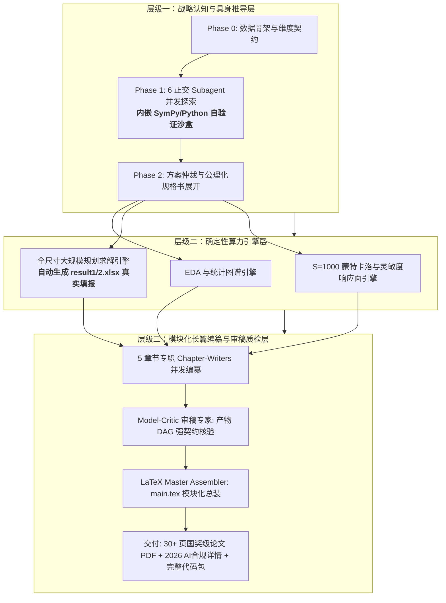

# Math-Modeling Multi-Agent Orchestration Skill (数学建模多智能体协同流水线)

[](https://opensource.org/licenses/MIT)
[](https://www.mcm.edu.cn)

工业级/竞赛级（面向全国大学生数学建模竞赛 CUMCM、美赛 MCM/ICM）数学建模多智能体协同插件。

---

## 🌟 系统核心架构与设计哲学

本系统颠覆了传统“单 Agent 浅层对话”与“黑盒大模型漫无边际生成”的模式，重构为 **三层解耦 + 产物有向无环图（Artifact DAG）+ 具身内嵌 Python 自验证 + 5 章节并行编纂** 的工业级自动化体系：



---

## 📂 技能工程目录结构

```text
math-modeling/
├── SKILL.md                            # [技能总控入口] 跨平台调度与状态机
├── README.md                           # 工程说明文档
├── .gitignore                          # 过滤规则
├── roles/                              # [专职 Subagent 提示词与内省协议]
│   ├── model_critic.md                 # 审稿专家（产物 DAG 强契约审查与三级预警）
│   ├── modeling_synthesizer.md         # 方案仲裁与四维量化打分矩阵
│   ├── deep_formalizer.md              # 公理化数学推导引擎
│   ├── online_prior_scout.md           # 联网先验探查者
│   ├── online_benchmark_miner.md       # 顶刊基准勘察者
│   ├── offline_mechanistic.md          # 微分机理与纵向动力学派 (含具身 Python 自验证沙盒)
│   ├── offline_optimization.md         # 离散运筹与时空规划派 (含具身 Python 自验证沙盒)
│   ├── offline_survival_stat.md        # 随机生存与 CVaR 规划派 (含具身 Python 自验证沙盒)
│   └── offline_robust_decision.md      # 稳健质控与秩相关决策派 (含具身 Python 自验证沙盒)
├── templates/                          # [长篇排版与合规模板]
│   ├── main_template.tex               # 模块化 30+ 页 LaTeX 总装模板 (\input 架构)
│   └── ai_disclosure_template.md       # 2026 官方合规《AI工具使用声明与详情》模板
├── references/                         # [审稿规则与高分范式库]
│   └── cumcm_reviewer_pitfalls.md      # 提炼自命题组与评阅专家的扣分拦截与升级梯子库
└── scripts/                            # [确定性底层算法工具箱]
    ├── greedy_segmentation.py          # 有序特征异质性贪心切分算法
    ├── lmm_variance_decomp.py          # 纵向 LMM 方差分解与 REML 评估器
    ├── robust_qc_3zone.py              # 非参数 5%/95% 质控与自适应三区双阈值器
    └── cluster_bootstrap.py            # 簇级 Bootstrap 95% 置信区间与 MAD 噪声扰动分析器
```

---

## 🚀 跨 Agent 平台使用指南

### 1. 在 Google Antigravity 中运行
直接将本文件夹放置于 `~/.gemini/config/skills/math-modeling/`。
当在 Antigravity 中输入数学建模赛题任务时，系统自动识别并调用 `invoke_subagent` 并发执行。

### 2. 在 Claude Code / Cursor / 独立 CLI 中运行
基于工作区 `.modeling/` 的标准文件系统黑板协议，依次按照 Phase 0 到 Phase 5 加载 `roles/` 中的提示词与 `scripts/` 工具包，完成自动化求解与论文编译。

---

## 📜 竞赛合规性声明
本体系严格遵循《全国大学生数学建模竞赛人工智能工具使用规定（2026年试行）》，采用“参赛队主导顶层设计 + 确定性算法数值全流程交叉验证”的规范机制，自动生成合规的《AI工具使用声明》与《AI工具使用详情.pdf》支撑材料。
